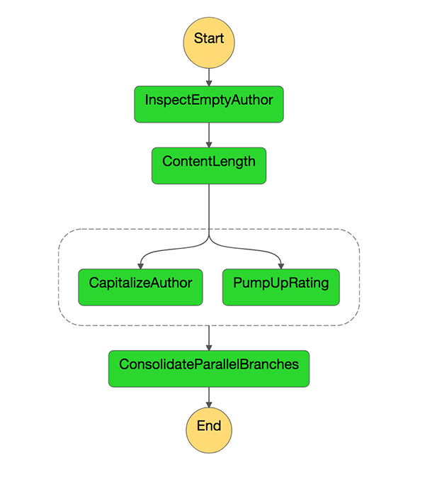

## AWS Lambda Article Processor
This repo contains A test app that attempts to recreate concepts from actor model design patterns in Lambda. The focus is on lambda rather than the on the programming language itself. I have chosen Python because it gives a quicker feedback loop and shorter cold start time.

#### Motivation
I have had experience working with Akka Actor model, and I feel that there is some degree of resemblance between lambda functions and stateless actors. However, I need to understand more to be able to draw that comparison. TDD'ing, writing and deploying actors is rather simple in Scala. I am curious if the same can be achieved with AWS lambda.

#### Design consideration
I am going to treat each lambda as a stateless actor. It should be able to do one thing only (from domain perspective) and do it very well.

#### Domain
For this exercise, I am assuming that I want to go through a hypothetical collection or a stream of articles. Each article has the following fields

- author
- content
- priority

The operations I am going to perform

1. Validate that a record has an author name attached, if not attach an error code
2. Count the number of words in the content
3. At the same time

    - Capitalize the first letter of each word of the author name

    - Add five to the rating (this channel has higher rating compared to other channels)

## Implementation



_Lambda Functions_ and _Step Function State Machine_ are used together to create a pipeline that resembles the implementation mentioned above.

### Deployment pipeline

[pipeline.yaml] is a CloudFormation template that creates our three stages deployment. Those are `Source`, `Build` and `Deploy`.

`Source` stage picks up the source code from Github (this repo).

`Build` runs the [buildspec.yml] file, which in turn runs the unit tests and packages our application (I think in the future, this should be two separate stages)

`Deploy` Creates and executes [template.yml] _CloudFormation_ template. The template includes both the definition of the lambda functions and the state machine definition.

## Notes

I find embedding FSM JSON definition into [template.yml] YAML template to be very annoying. I couldn't find a way to import the FSM definition from a separate file. I am considering using a script to embed JSON into the template in the build stage in the future and keep both separated. Currently, they look like this:

```YAML
Properties:
  DefinitionString:
    !Sub
      - |-
        {
          "Comment": "Article Processing State Machine",
          "StartAt": "InspectEmptyAuthor",
          "States": {
            "InspectEmptyAuthor": {
              "Type": "Task",
              "Resource": "${inspectEmptyAuthorFunctionArn}",
              "Next" :"ContentLength"
            },
            "ContentLength": {
              "Type": "Task",
              "Resource": "${contentLengthFunctionArn}",
              "End": true
            }
          }
        }
      - {inspectEmptyAuthorFunctionArn: !GetAtt [ InspectEmptyAuthorFunction, Arn ], contentLengthFunctionArn: !GetAtt [ ContentLengthFunction, Arn ]}

```
